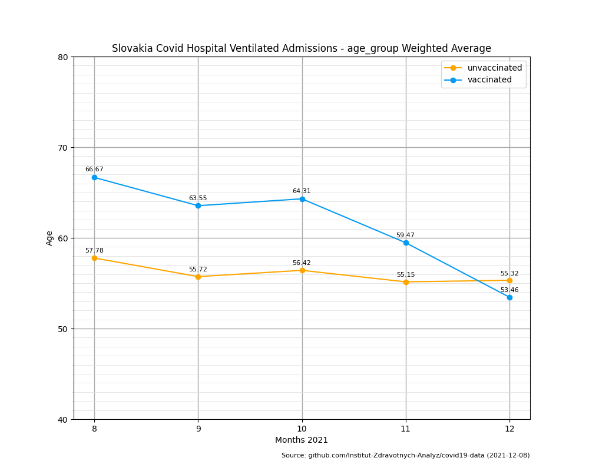

# slovakia-covid19-data-py-graphs
[Version 1.0.0][changelog]

Python graphs of [open data sets](https://github.com/Institut-Zdravotnych-Analyz/covid19-data) related to the covid19 pandemic in Slovakia provided by the MoH of Slovakia.

## Graphs available
To see all graphs go to "res" folder.

1. Hospitalizations\Ventilated_Admissions_Age_WAverage_by_Vaccine_Daily.py

2. Hospitalizations\Ventilated_Admissions_Age_WAverage_by_Vaccine_Monthly.py

[changelog]: ./CHANGELOG.md